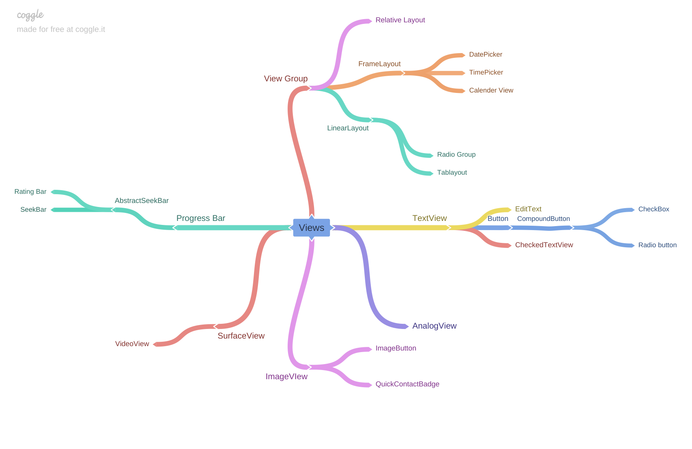
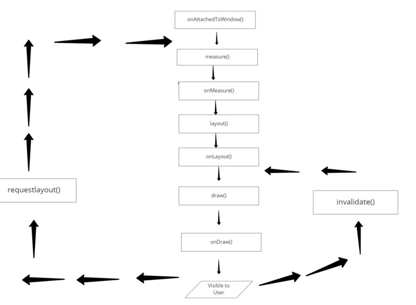

# 커스텀
[타룬 샤르마의 Android 사용자 정의보기](https://proandroiddev.com/android-custom-view-level-1-67ed1c3febe1)의 시리즈를 보고 내용을 정리한 것이다.

## What is View?
Android UI의 최상의 부모 Class로 사각형 영역의 다양한 그림과 이벤트 처리(클릭, 터치 등), 속성등을 제공한다.

## What is ViewGroup?
```java
public abstract class ViewGroup extends View implements ViewParent, ViewManager
```
ViewGroup은 View의 자식 Class이다. 
그러면서도 모든 Layout Class의 최상위 부모 Class이다.
ViewGroup은 View 또는 ViewGroup를 보유할 수 있는 **보이지 않는 컨테이너** 이다.

## View Child Map


## View Constructor
```java
public View(Context context)
public View(Context context, @Nullable AttributeSet attrs)
public View(Context context, @Nullable AttributeSet attrs, int defStyleAttr)
public View(Context context, @Nullable AttributeSet attrs, int defStyleAttr, int defStyleRes)
```
View에는 4개의 기본 생성자가 있다.
각각의 의미를 알아볼 것이다.

```java
public View(Context context)
```   
View를 만드는데 최소한 Context가 필요로 하다.
주로 코드상에서 View를 생성할때 많이 사용되는 생성자이다.

```java
public View(Context context, @Nullable AttributeSet attrs)
```
`AttributeSet`는 속성 Set 만드는데 필요한 기능을 정의한 Interface이다.
`AttributeSet`의 유일한 자식은 `XmlResourceParser` 인터페이스인데 
사실 이 메소드는 주로 Xml에서 정의한 경우 호출된다.

```java
public View(Context context, @Nullable AttributeSet attrs, int defStyleAttr)
public View(Context context, @Nullable AttributeSet attrs, int defStyleAttr, int defStyleRes)
```
이 생성자는 모든 UI 요소에 기본 스타일을 적용하는 데 사용된다. 
`defStyleAttr`는 (테마에서 정의한)`View`에 적용 할 기본 스타일(background, color)을 지정합니다.
`defStyleResource`는 `defStyleAttr`에서 사용하지 않은 속성을 적용할 기본 스타일이다.


## Canvas, Paint 
Custme View에서 도형이나 텍스트를 그리려면 Canvas(비트맵), Paint(2D 그리기 Class)가 필요하다.
물론 이방법까지 안사용하고 기존 Button(view)를 상속받고 적용하는 방법도 있다. (혹은 FrameLayout을 상속받아 `View.inflate`을 이용해서 만들어도 된다.)

Canvas, Paint를 예시
```kotlin
class CustomeView(context: Context) : View(context) {

    var paint: Paint = Paint()
    var centerOfX = 340F  // X 축의 원 중심
    var centerOfY = 340F  // Y 축의 원 중심
    var radiusOfCircleView = 140F  // 원의 반경

    init {
        paint.color = ContextCompat.getColor(context, android.R.color.holo_green_light)
        paint.strokeWidth = 40f
        paint.style = Paint.Style.STROKE // 생성자 호출
    }

    override fun onDraw(canvas: Canvas?) {
        canvas!!.drawCircle(centerOfX, centerOfY, radiusOfCircleView, paint)
        super.onDraw(canvas)

    }
}
```

다음 코드를 메인에서 추가해주자 
```kotlin
val circleView = CustomeView(this)
        setContentView(circleView)
```


## XML로 CustmeView 추가
```xml
<CustomeView
    android:layout_width="wrap_content"
    android:layout_height="wrap_content"
    app:layout_constraintLeft_toLeftOf="parent"
    app:layout_constraintBottom_toBottomOf="parent"/>
```
하지만 이것만 추가하면 `InflateException`이 발생할 것이다.
`CustomeView`의 생성자를 추가(혹은 변경)해야한다.
```kotlin
class CustomeView constructor(context: Context, attrs: AttributeSet? = null): View(context, attrs)
```

## 속성을 정할 수 있도록 속성정의하기
일단 원의 색을 지정할 수 있도록 속성을 추가하자
1. `res/values/attrs.xml` 파일을 추가한다.
2. `attrs.xml`파일에 아래와 같이 만든다.
    ```xml
    <?xml version="1.0" encoding="utf-8"?>
    <resources>

        <declare-styleable name="CustomeView">
            <attr name="circleColor" format="color"/>
        </declare-styleable>

    </resources>
    ```
3. `CustomeView` init 메소드에 다음 소스를 추가한다.
    ```kotlin
    context.theme.obtainStyledAttributes(
        attrs,
        R.styleable.CustomeView,
        0,
        0
    ).apply {
        paint.color = getColor(R.styleable.CustomeView_circleColor, paint.color)
    }
    ```

4. xml을 다음과 같이 구성한다.
    ```xml
    <com.yeh35.android.stickyslideviewexample.CustomeView
        android:layout_width="300dp"
        android:layout_height="300dp"
        app:circleColor="@color/black"
        app:layout_constraintLeft_toLeftOf="parent"
        app:layout_constraintBottom_toBottomOf="parent"/>
    ```

    `circleColor` 속성이 추가 되었다.

정리, 사용자 지정 속성을 사용하려면 `res/values`폴더에 `attrs.xml`가 있어야하고 
`< declare-styleable>`테그를 이용하여 사용자 정의 속성을 추가할 수 있다(혹은 지정). 
각 속성은 `KEY` 및 `Value`로 한다.

code에서 각 속성을 불러올때는 `TypedArray`의 `Get`메소드들을 이용해서 불러온다.

## 나머지 생성자
아까 기본 속성값을 설정하는 생성자 2개가 더 있다고 하였다.
테마 개념만 익힌다면 사용자 정의속성과 크게 다르지 않다.
자세한 내용은.. pass


## View Life-cycle
여기부터는 Andorid Drowing process에 대한 이론적인 내용까지 포함하게 된다.   
(커피 한잔을 준비하고 단단한 맘으로 읽기를...)

   
먼저 life cycle에 메소드들부터 하나씩 살펴보면 
* `onAttachedToWindow()`는 뷰가 창에 연결될 때 호출된다.
* `onDettachToWindow()`는 `onAttachedToWindow` 반대로 연결이 끊어질때 호출된다.
* `onMeasure(int, int)`는 View와 View의 자식에 대한 크기를 요구사항을 결정하기 위해 호출된다.
* `setMeasuredDimension(int, int)`는 `onMeasure(int, int)`와 비슷한 일을 한다.
* `onLayout(int, int, int, int)`는  자식에게 크기와 위치를 할당해야 할 때 호출된다.
* `onDraw(android.graphics.Canvas)`는 콘텐츠를 렌더링해야 할 때 호출된다. Canvas를 인수로 제공하며 Paint 클래스 Instance를 사용하여 캔버스에 무엇이든 그립니다.

### Android System UI Drwring process
`Activity`가 실행되면 `Android Framework`는 계층구조 의 **루트노드(Layout파일에 최상단 View)를 제공하기 위해 활동 요청** 을 한다.

예를들어 다음과 같은 `activity_main.xml` 파일이 있다고 한다면 
```xml
<androidx.constraintlayout.widget.ConstraintLayout 
    xmlns:android="http://schemas.android.com/apk/res/android"
    xmlns:app="http://schemas.android.com/apk/res-auto"
    xmlns:tools="http://schemas.android.com/tools"
    android:layout_width="match_parent"
    android:layout_height="match_parent"
    tools:context=".CustomeActivity">

    <CustomeView
        android:layout_width="300dp"
        android:layout_height="300dp"
        app:circleColor="@color/black"
        app:layout_constraintLeft_toLeftOf="parent"
        app:layout_constraintBottom_toBottomOf="parent"/>

</androidx.constraintlayout.widget.ConstraintLayout>
```
모든 자식(지금은 하나지만..)포함한 `ConstraintLayout`가 있다.
 **이 `ConstraintLayout`가 UI Drwing의 시작점이자, 루트노드이다.**

루트노드를 시작으로 Android Framework는 **Top-down (BFS) 방식으로 호출하며 View를 그려나간다.**
View Drawing에는 두가지 중요한 단계가 있는데
1. 각 View는 View 계층 구조에서 치수 사양을 계산한다. 이걸 `측정 통과`이라 부르는데
이 단계에서 `measure (int, int)`를 호출하여 모든 View의 크기를 정의한다. (`치수 사양`)
2. 이어서 `layout (int, int, int, int)`를 호출한다. 
이 과정에서 부모 View은 자식 View의 위치를 그린다. 또 상위 View는 먼저 측정한 `치수 사양`을 이용하여 하위 View를 화면에 배치한다.
    
#### 부모는 각 자녀의 View 높이와 너비 정의
부모 View는 `MeasureSpec` Class option을 이용하여 높이와 너비를 정의한다.
* `UNSPECIFIED`: 자식의 경계를 확장할 수 있음
* `EXACTLY`: 자식이 정확한 크기
* `AT_MOST`: 자식이 특정 제한까지 확장 할 수 있음

각 View는 `layout_width`, `layout_height`을 정의할때 `ViewGroup.LayoutParams` 클래스 옵션에 의해서 정의된다.
1. 정확한 숫자 (ex: 100dp)
2. match_parent (뷰가 부모의 크기와 동일)
3. wrap_content (뷰가 콘텐츠를 래핑)

이 프로세스는 여러번 반복될 수 있다. `View`와 부모 `View`의 상호작용에 따라서 `measure()`는 한번 이상 호출될 수 있다.

#### 이제 그릴 시간이다. 
위의 과정을 끝났다면 치수와 위치가 정해졌다. 
앞서 말했든 루트 노드부터 시작해서 자식으로 가면서 그려진다.
그래야지 부모위에 자녀가 그려질 것이다.


## LifeCycle Flow 자세하게 보기!
앞서 LifeCycle에 대해서 얇게 살펴봤다. 
이번에는 각 설명안한 흐름을 설명할 것이다.


* `onDraw()`와 `draw()`의 차이점
    `draw(Canvas c)`는 Canvas에 도형을 그리는 동안 내부적으로 `onDraw(Canvas c)`를 호출한다.
    커스텀 뷰의 경우 `onDraw(Canvas c)`에 어떻게 그릴 것인지 정의한다.

* 보기의 높이와 너비 또는 크기를 설정하는 방법
    `onMeasure(widthMeasureSpec, heightMeasureSpec)`를 이용해서 크기와 너비를 지정한다. 여기서 주의할점이 
    부모의 `onMeasure`를 호출해줘야 한다는 것이다. 부모 View의 패딩 계수, 최소 높이 및 최대 높이 및 너비 및 높이 사양등을 고려하려면 `super.onMeasure(widthMeasureSpec, heightMeasureSpec)`을 통해서 호출해야한다. 
    그렇지 않으면 `inflate-exceptions`을 마지한다.

* `onFinishInflate()`는 View 및 모든 하위 항목이 XML에서 확장 된 후에 호출됩니다.

* `invalidate()` 특정 View를 다시 그려야할 때 호출된다.

* `requestLayout()` View의 사양 (높이 및 너비)을 다시 계산해야 할 때 호출된다. 주로 `draw` 단계보다 `measure`, `layout` 단계에서 호출된다.


### 더 나아가서..
사실 모든 View를 직접 paint를 이용해 그리는 것인 쉽지 않다.
Google에서 제공하는 `TextView`, `ImageView`등 다양한 View를 상속받아 거기에 추가 기능을 넣는 식으로 개발하는 경우가 많을 것이다. 

## 참고
* [타룬 샤르마의 Android 사용자 정의보기](https://proandroiddev.com/android-custom-view-level-1-67ed1c3febe1)