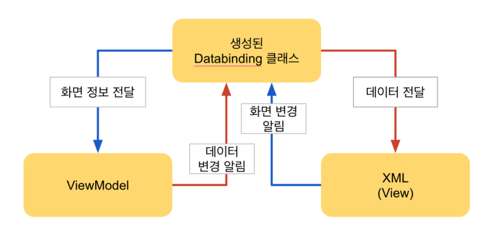

# MVVM
MVVM이라는 용어는 많이 들어봤지만 스스로도 모르게 사용하고 있었을 것이다.
이번에 그 내용을 정리해보려고 한다.

MVVM은 Model, View, ViewModel 3가지를 합친 것이다.   


(삼단 합체~!)

## Model
비지니스 로직이나 유효성 검사와 같은 데이터를 다루는 행위를 수행한다.
도메인이라고 해도 될것 같다.

## View
View는 화면에 표현되는 레이아웃에 대한 것이다.  
기본적으로 비지니스 로직을 배제하고 UI와 관련된 로직을 수행한다.

## ViewModel
View에 연결 할 데이터와 명령으로 구성되어있으며 변경 알림을 통해서 View에게 상태 변화를 전달한다.
전달받은 상태변화를 화면에 반영할지는 View가 선택하도록 한다. 
(Reacative Stream을 ?!)


sources : https://docs.microsoft.com/en-us/xamarin/xamarin-forms/enterprise-application-patterns/mvvm

여기서 중요한 것은 3개를 어떻게 연결하는 가이다.
* View는 Model은 모르고 ViewModle을 알고 옵저빙(데이터 바인딩)한다. 
* ViewModel은 View는 모르고 Model을 알고 사용한다.

## View와 ViewModel의 연결


sources : https://medium.com/@jsuch2362

````kotlin
class View: Activity() {

    override fun onCreate(savedInstanceState: Bundle?) {
        super.onCreate(savedInstanceState)

        val tv : TextView = findViewById(R.id.textView)
        val viewModel = ViewModel()

        viewModel.name.observe {
            tv.text = it
        }

        tv.setOnClickListener {
            viewModel.chageNameMisKim()
        }
    }

}

class ViewModel {

    private val _name: String = "John"
    val name = Observable("")

    init {
        // ViewModel 용 데이터 변경
        name.set(_name)
    }

    fun chageNameMisKim() {
        name.set("MisKim!!")
    }
}
````
(예시를 위한 코드고, 작동하지 않는 코드이다)   

하지만 이렇게 작성하면 View에 ViewModel의 코드가 너무 많이 들어가게 된다.   
이걸 줄이려면 Databinding 기술을 사용하면 View와 ViewModel에 의존성을 더 낮출 수 있다.   
Databinding을 사용하면 `tv.text = it`이런 코드는 작성하지 않아도 된다.   

DataBinding을 잘 사용하는 방법은 차차 공부해가면서 알아봐야할듯...   
참고할만한 사이트 
* [Android MVVM 을 위한 Databinding](https://medium.com/@jsuch2362/android-mvvm-%EC%9D%84-%EC%9C%84%ED%95%9C-databinding-34cd9be44c63)


# 연사
MVVM은 마틴 파울러의 '[프레젠테이션 모델 디자인 패턴](https://martinfowler.com/eaaDev/PresentationModel.html)'의 변형으로 마소의 아키텍트인 켄 쿠퍼와 테드 피터스에 의해서 발명되었다.


# 참조
* [Android 에서 MVVM 으로 긴 여정을…](https://medium.com/@jsuch2362/android-%EC%97%90%EC%84%9C-mvvm-%EC%9C%BC%EB%A1%9C-%EA%B8%B4-%EC%97%AC%EC%A0%95%EC%9D%84-82494151f312)
* [위키피티아 모델-뷰-뷰모델](https://ko.wikipedia.org/wiki/%EB%AA%A8%EB%8D%B8-%EB%B7%B0-%EB%B7%B0%EB%AA%A8%EB%8D%B8)
* [프레젠테이션 모델 디자인 패턴](https://martinfowler.com/eaaDev/PresentationModel.html)