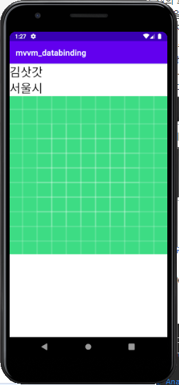

# MVVM
MVVM이라는 용어는 많이 들어봤지만 스스로도 모르게 사용하고 있었을 것이다.
이번에 그 내용을 정리해보려고 한다.

MVVM은 Model, View, ViewModel 3가지를 합친 것이다.   


(삼단 합체~!)

## Model
비지니스 로직이나 유효성 검사와 같은 데이터를 다루는 행위를 수행한다.
도메인이라고 해도 될것 같다.

## View
View는 화면에 표현되는 레이아웃에 대한 것이다.  
기본적으로 비지니스 로직을 배제하고 UI와 관련된 로직을 수행한다.

## ViewModel
View에 연결 할 데이터와 명령으로 구성되어있으며 변경 알림을 통해서 View에게 상태 변화를 전달한다.
전달받은 상태변화를 화면에 반영할지는 View가 선택하도록 한다. 
(Reacative Stream을 ?!)


sources : https://docs.microsoft.com/en-us/xamarin/xamarin-forms/enterprise-application-patterns/mvvm

여기서 중요한 것은 3개를 어떻게 연결하는 가이다.
* View는 Model은 모르고 ViewModle을 알고 옵저빙(데이터 바인딩)한다. 
* ViewModel은 View는 모르고 Model을 알고 사용한다.

## View와 ViewModel의 연결


sources : https://medium.com/@jsuch2362

````kotlin
class View: Activity() {

    override fun onCreate(savedInstanceState: Bundle?) {
        super.onCreate(savedInstanceState)

        val tv : TextView = findViewById(R.id.textView)
        val viewModel = ViewModel()

        viewModel.name.observe {
            tv.text = it
        }

        tv.setOnClickListener {
            viewModel.chageNameMisKim()
        }
    }

}

class ViewModel {

    private val _name: String = "John"
    val name = Observable("")

    init {
        // ViewModel 용 데이터 변경
        name.set(_name)
    }

    fun chageNameMisKim() {
        name.set("MisKim!!")
    }
}
````
(예시를 위한 코드고, 작동하지 않는 코드이다)   

하지만 이렇게 작성하면 View에 ViewModel의 코드가 너무 많이 들어가게 된다.   
이걸 줄이려면 Databinding 기술을 사용하면 View와 ViewModel에 의존성을 더 낮출 수 있다.   
Databinding을 사용하면 `tv.text = it`이런 코드는 작성하지 않아도 된다.   

## DataBinding 
DataBinding을 잘 사용하는 방법은 차차 공부해가면서 알아봐야할듯...   

### 참고할만한 사이트 
* [Android MVVM 을 위한 Databinding](https://medium.com/@jsuch2362/android-mvvm-%EC%9D%84-%EC%9C%84%ED%95%9C-databinding-34cd9be44c63)
* [MVVM AAC Databinding 사용법](https://medium.com/@gus0000123/android-databinding-%EC%82%AC%EC%9A%A9%EB%B2%95-9a3480a3bfc7)

[mvvm_databinding](./mvvm_databinding) 폴더는 DataBinding을 연습하기 위한 폴더이다.

### 기본 설정
아래와 같이 App단의 Gradle 설정을 변경한다.
```gradle
android {
    ...
    buildFeatures {
        dataBinding = true
    }
    ...
}
```
`dataBinding = true`을 할 경우 android 플로그인이 컴파일 할 때 필요한 바인딩 클래스를 생성한다.   
(따로 implementation는 필요 없음)

```gradle
plugins {
    id 'kotlin-android'
    id 'kotlin-kapt'
}
```
코틀린인 경우 필수로 App Gradle 설정파일에 다음과 같은 플로그인을 추가해야한다.
추가하지 않을 경우 빌드에서 Symbol에러가 날 것이다.

### Fragment DataBinding
Fragment의 데이터 바인딩을 해보려고 한다.

fragment_mvvm.xml 
```xml
<?xml version="1.0" encoding="utf-8"?>
<layout xmlns:android="http://schemas.android.com/apk/res/android"
    xmlns:app="http://schemas.android.com/apk/res-auto">

    <data>
        <variable
            name="user"
            type="com.example.mvvm_databinding.User"/>
        <variable
            name="address"
            type="com.example.mvvm_databinding.Address"/>
    </data>

    <FrameLayout
        android:layout_width="match_parent"
        android:layout_height="match_parent">

        <LinearLayout
            android:layout_width="match_parent"
            android:layout_height="match_parent"
            android:orientation="vertical">

            <TextView
                android:id="@+id/tv_name"
                android:layout_width="match_parent"
                android:layout_height="wrap_content"
                android:textColor="@color/black"
                android:textSize="30sp"
                android:text="@{user.name}" />

            <TextView
                android:id="@+id/tv_address"
                android:layout_width="match_parent"
                android:layout_height="wrap_content"
                android:textColor="@color/black"
                android:textSize="30sp"
                android:text="@{address.address}" />

            <ImageView android:layout_width="match_parent"
                android:layout_height="wrap_content"
                app:bind_image="@{user.profileURL}"/>

        </LinearLayout>


    </FrameLayout>

</layout>
```
fragment의 layout xml파일이다. 
기존의 fragment의 layout xml파일과 다른점은 ViewGroup에 속해있는 레이아웃(FrameLayout 등)을 루트 태그로 사용하는 것이 아니라 `<layout>` 테그를 루트 테그로 사용한다.
`<layout>` 테그를 사용할 때 주의할점은 `<layout>` 테그는 하나 자식 레이아웃만 선언할 수 있다.
그러지 않을 경우 `data binding error`에러를....

`<data>`는 데이터 바인딩할 ViewModel를 정의해준다.
앞서 이야기 했듯 view는 ViewModel을 알지만 ViewModel은 View를 모른다.
즉 ViewModel은 여러개 연결해도 상관없다.
(하지만 보통 View랑 1 대 1을 하게 된다)

MVVMFragment.kt
```kotlin
class MVVMFragment: Fragment() {

    private lateinit var binding: FragmentMvvmBinding

    override fun onCreateView(
        inflater: LayoutInflater,
        container: ViewGroup?,
        savedInstanceState: Bundle?
    ): View? {

        binding = DataBindingUtil.inflate(inflater, R.layout.fragment_mvvm, container, false)
        val root = binding.root
        val user = User()
        binding.user = user
        binding.address = Address("서울시")

        user.setProfileURL(R.drawable.ic_launcher_foreground)

        return root
    }
}
```

Fragment를 XML과 연결할 때 기존에는 `onCreate` 메소드를 오버라이드를 시켜서 생성하는데 여기서는 
`onCreateView`를 사용한다.

`DataBindingUtil.inflate`이라는 정적 메소드를 통해서 `FragmentMvvmBinding`를 생성하는데 `FragmentMvvmBinding`는 빌드 과정에서 `fragment_mvvm`를 읽고 자동으로 생성한 class이다.

**주의! Binding class 생성에는 다음과 같은 규칙을 따른다.**
1. Binding 클래스는 레이아웃 파일의 이름을 기준으로 생성되어 파일 이름을 파스칼 표기법으로 변환하고 그 뒤에 “Binding”을 접미사로 붙입니다.
2. 컴포넌트아이디는 “_”를 기준으로 카멜 표기법으로 변환됩니다.
3. xml에서 tv_name 이라고 했을 때 tvName으로 생성된다.

User.kt
```kotlin
class User: ViewModel() {
    private val _name: MutableLiveData<String> = MutableLiveData()
    val name: LiveData<String>
        get() = _name

    private val _profileURL = MutableLiveData<Int>()
    val profileURL: LiveData<Int>
        get() = _profileURL

    init {
        _name.value = "김삿갓"
        _profileURL.value = -1
    }

    fun setProfileURL(i: Int) {
        _profileURL.value = i
    }
}
```
ViewModel로써 View를 좀더 추상화 시킨 것이다.
LiveData는 다른 observer 개체들과 달리 생명주기를 인식해서 필요없는 경우 notification(알림)을 하지 않는다.
(LiveData를 여기서는 대충 사용한 것임으로 그러려니 하고 넘어가지)
[LiveData](https://developer.android.com/topic/libraries/architecture/livedata?hl=ko)
* UI와 데이터 상태 일치 : Observer 패턴을 따라서 데이터가 수정시 알람을 발생
* 메모리 누출 없음 : 관찰자의 lifecycle 개체에 결합되어 생명주기가 끝나면 자동으로 삭제
* 그외 등등..

### 이벤트 처리
아래 코드는 작동되는 코드는 아니고 이런식으로 작성할 수 있다는 것을 보여준다.

``` kotlin
class MainViewModel() : ViewModel() {
    var clickConverter = MutableLiveData<Unit>()

    //클릭 이벤트를 받아온다.
    fun onClickHandler() {
        clickConverter.value = Unit
    }
}
```

```xml
<import type="android.view.View"/>
<variable
        name="viewModel"
        type="com.hyun.android.databindingsample.MainViewModel"/>
...
<ImageView android:layout_width="match_parent"
           android:layout_height="wrap_content"
           android:onClick="@{()->viewModel.onClickHandler()}"
           app:bind_image="@{user.profileURL}"
           app:bind_image_error="@{@drawable/error_sample}"/>
```
봐야할 것은 `android:onClick="@{()->viewModel.onClickHandler()}"`이다. 굳이 Activity Class에서 정의하지 않아도 위와 같이 호출 할 수도 있다.

### 커스텀 바인딩 어댑터
`app:bind_image`를 보고 이게 뭐지 했을 것이다.
이건 Text같이 간단한 화면 말고 gif image를 보여주는 복잡한 처리를 해야해서 직접 만든 어댑터이다.

CustomBindingAdapter.kt
```kotlin
@BindingAdapter("bind_image")
fun bindImage(view: ImageView, res: Int?) {
    Glide.with(view.context)
        .load(res)
        .into(view)
}

@BindingAdapter("bind_image", "error_image")
fun bindImage(view: ImageView, res: Int?, error: Int) {
    Glide.with(view.context)
        .load(res)
        .error(error)
        .into(view)
}
```
`Glide`는 이미지를 세팅해주는 라이브러리이다. 자세한 내용은 pass..
`BindingAdapter`에 정의된 `bind_image`가 보일 것이다. 이제 어떤식으로 작동되는지 대충 감이 오는가?
BindingAdapter가 우리가 정의해준 `bind_image`, `error_image` 속성들을 보고 필요한 메소드를 찾아서 빌드중 코드를 생성해준다.
어떤 메소드를 사용하는지 아님 어떤식으로 전달되는지 자세하게 알고 싶다면 `FragmentMvvmBindingImpl`을 찾아가서 보면 된다.

물론 `BindingAdapter`을 잘못 정의하면 `FragmentMvvmBindingImpl`을 생성하지 못하고 `cannot find symbol`에러가 난다.
주의! 
1. **첫번째 파라미터로 View 개체**를 받아야 하며 ImageView만 사용하게 하고 싶으면 View 대신 ImageView를 받으면 된다.
2. 선언한 값들과 파라미터 인자들은 1:1로 매칭되어야 한다.
`@BindingAdapter("bind_image", "error_image")`이렇게 두개가 선언되어 있으면 파라미터는 view, bind_image, error_image 3개가 있어야 한다.

### 지금까지 작업의 결과물..



# 아키텍처 가이드 구현한다면?


[MVVM AAC Databinding 사용법](https://medium.com/@gus0000123/android-jetpack-databinding-%EC%82%AC%EC%9A%A9%EB%B2%95-3-%EC%83%81%EC%84%B8%ED%8E%B8-afcc96ac3690)글에서 나온 예제인데 폴더 구조와 Class를 보고 이해가 갔다.    
나중에 안간다면 글의 예제소스를 [DatabindingSample](./DatabindingSample)에 남겨놨다.


# 역사
MVVM은 마틴 파울러의 '[프레젠테이션 모델 디자인 패턴](https://martinfowler.com/eaaDev/PresentationModel.html)'의 변형으로 마소의 아키텍트인 켄 쿠퍼와 테드 피터스에 의해서 발명되었다.


# 참조
* [Android 에서 MVVM 으로 긴 여정을…](https://medium.com/@jsuch2362/android-%EC%97%90%EC%84%9C-mvvm-%EC%9C%BC%EB%A1%9C-%EA%B8%B4-%EC%97%AC%EC%A0%95%EC%9D%84-82494151f312)
* [위키피티아 모델-뷰-뷰모델](https://ko.wikipedia.org/wiki/%EB%AA%A8%EB%8D%B8-%EB%B7%B0-%EB%B7%B0%EB%AA%A8%EB%8D%B8)
* [프레젠테이션 모델 디자인 패턴](https://martinfowler.com/eaaDev/PresentationModel.html)