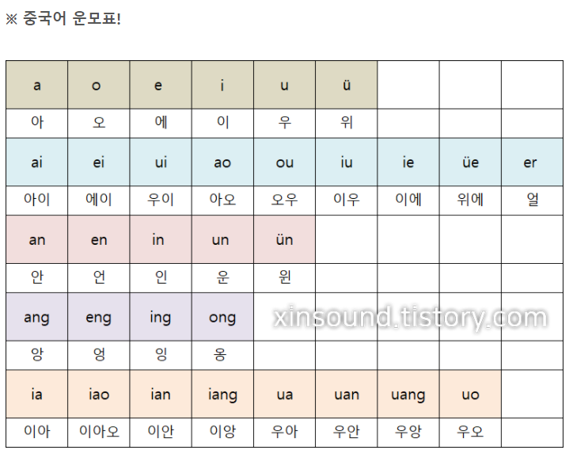

# 성모 운모
중국어는 글자마다 읽는 기호가 있다.
그 기호를 병음이라고 하는데 병음에는 성모와 운모로 나뉜다.
**성모는 자음에 해당하고 운모는 모음에 해당한다.**

## 운모

## 성모

유트브를 검색해보니 기초인데 너무 재미있게 하는게 있어서 몇번 돌려보면 좋을거 같다.
https://www.youtube.com/watch?v=f9DvFp9LV-w&list=PLXn0heh_hSoQ44qCA1a-AVwgIa3hkhxBE&index=1