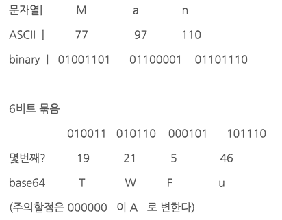
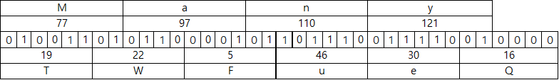
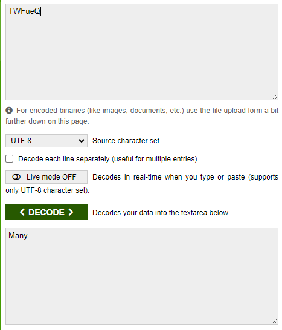

# Base64
[Binary Data를 Text로 바꿔주는 Encoding](https://en.wikipedia.org/wiki/Binary-to-text_encoding)의 하나로써 Binary Data를 Character set에 영향을 받지 않는 공통 ASCII 영역의 문자로만 이루어진 문자열로 바꾸는 Encoding이다.

Base64를 글자 그대로 직역하면 64진법 뜻으로 2의 6제곱수이며 **ASCII 문자들로 표현할 수 있는 가장 큰 진법이다.**   
ASCII에는 제어문자가 다수 포함되어 있기 때문에 화면에 표시되는 ASCII문자는 128개가 되지 못한다.  

## 작동 방식
Binary Data를 6 bit 씩 자른 뒤 6 bit에 해당하는 문자를 아래 Base64 색인표에서 찾아 치환한다.
(실제로는 Padding을 더해주는 과정이 추가된다.)    

작동은 `문자열 -> ASCII binary -> 6bit cut -> base64_encode`순으로 진행된다.
하지만 한가지 문제접이 있다.   
모든 문자열이 3개씩 남김없이 끊어지진 않는 다는 것이다.
만약 3개씩 끊어지지 않고 빈자리가 생긴다면 인코딩 후 패딩문자(`=`)가 빈공간만큼 들어간다.

## 인코딩 해보기
`Many`를 인코딩 하게 되면 다음과 같은 과정을 격는다.

'y'를 변환할때 2개의 비트가 남았다. 
6비트를 맞추기 위해서 옆에 4개의 0비트를 붙이고 인코딩하였다.
인코딩이후 `TWFueQ`가 되었지만 y뒤에 2개만큼 빈공간이 있었다는 것을 알려주기 위해 패딩문자(`=`) 두개를 이어 붙였다.

최종 인코딩은 `TWFueQ==`가 된다.
https://www.base64encode.org/ 라는 사이트에서 인코딩 해볼 수 있다.

## 왜 사용하는가?
Base64 Encoding을 하게되면 전송해야 될 데이터의 양도 약 33% 정도 늘어난다.
6bit당 2bit의 Overhead가 발생하기 때문이다.
Encoding전 대비 33%나 데이터의 크기가 증가하고, Encoding과 Decoding에 추가 CPU 연산까지 필요한데 왜 사용하는 것일까?

문자를 전송하기 위해 설계된 Media(Email, HTML)를 이용해 플랫폼 독립적으로 Binary Data(이미지나 오디오)를 전송 할 필요가 있을 때, ASCII로 Encoding하여 전송하게 되면 여러가지 문제가 발생할 수 있다. 
* ASCII는 7 bits Encoding인데 나머지 1bit를 처리하는 방식이 시스템 별로 상이하다.
* 일부 제어문자 (e.g. Line ending)의 경우 시스템 별로 다른 코드값을 갖는다.

위 같은 문제로 **ASCII는 시스템간 데이터를 전달하기에 안전하지가 않다**   
Base64는 ASCII 중 제어문자와 일부 특수문자를 제외한 **64개의 안전한 출력 문자만 사용**한다.

## 궁금! 패딩을 붙이는 이유
먼저 패딩을 안사용하고 디코딩을 해보고, 패딩을 붙이는 이유를 알아본다.

디코딩할때 디코딩할 비트의 크기를 알고 있다면 나머지는 버리면 된다.
   
앞에서 봤던 예제인데 재탕하자면 base64로 인코딩 이후 `TWFueQ==`가 되었다.
padding을 제거하면 `TWFueQ`가 될것이다. 이상태에서도 8비트 단위로 끊어서 읽고 나머지는 버리면 충분히 디코딩할 수 있다.

앞서서 패딩이 불필요하다는 걸 알았다. 그럼 왜 패딩을 붙일까?
패딩은 바이트 길이에 명확성을 나타내려고 사용된다. 

프로토콜 설계시 각 단어(데이터) 앞에 정수의 길이(패딩)를 추가로 붙이는 것과 동일하다.
수신자가 제대로 디코딩하려면 결국 패딩이 필요하다.
(제대로라는 것은 통신중 비트 손실이라던지 하는 것을 방지하기 위함이다. 길이가 안맞으면 다시 보내달라고 하면 되니까)

다른 예시로 비디오를 인코딩하는 경우 청크의 길이를 미리 알지 못한다. 그럴 때 청크의 끝에 (`=`같은)패딩을 넣어준다면 수신자는 패딩을 만나는 것으로 청크의 끝을 알 수 있다.
수신자는 스트림하게 decoding을 처리 할 수 있게 되는 것이다.

`M`, `an`, `y`를 나눠서 인코딩 하게 되면 `TQ==`, `YW4=`, `eQ==`이 된다.
그리고 스트림하게 받는 경우 `TQ==YW4=eQ==`하게 데이터를 받게 된다.
패딩을 지울경우 `TQYW4eQ` 수신자는 하나의 데이터라고 생각하고 통으로 읽게 된다.
decoding 해보니 `M` 이렇게 나왔다. 패딩을 포함해서 해석 할 경우 패딩을 만나는 것으로 데이터를 끊어서 읽으면 `Many`라고 제대로 받을 수 있을 것이다.
(물론 이 예시는 `TQ==YW4=eQ==`를 통으로 base64라이브러리에 넣으면 작동하지 않을 것이다.)

## 웹에서는 패딩(=)을 뺴는 이유
base64로 인코딩된 정보를 URL 의 파라미터로 전달 될 때도 있는데
`=`문자는, url-safe 하지 않으므로, 제거하게 된다.

## 참고
* [Base64 인코딩이란?](https://effectivesquid.tistory.com/entry/Base64-%EC%9D%B8%EC%BD%94%EB%94%A9%EC%9D%B4%EB%9E%80)
* https://stackoverrun.com/ko/q/1020753