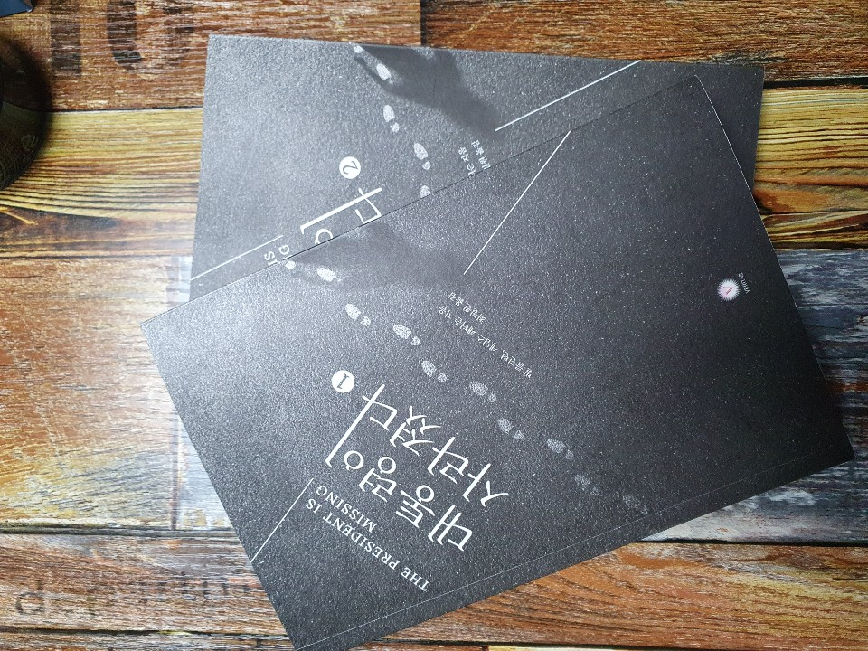

# 대통령이 사라졌다.

**`대통령이 사라졌다`는 미국 대통령이쓴 미국 대통령 소설책이다.**
그리고 미국 대통령이 써서 디테일을 사라있을지 몰라도 극적인 표현을 떨어질 수 있으나 `제임스 패터슨`라는 픽션계 거장과 함께 작업을 하였다.

소설책이여서 리뷰를 남기며 내용을 스포할까 조금은 조심스럽다.
소설책을 1년에 많이 읽어야 한권(?)정도 읽는다. 
항상 소설을 읽다보면 묘사가 머리속에 안그려진다거나 인물이 복잡하게 나오면(이름이 복잡하거나, 중구난방으로 나오는 경우 혹은 입체적으로 안나오는 경우) 책을 던져버렸다.
하지만 이 소설에서는 각 인물들의 성격 백악관의 모습 모든 장면 하나하나가 전두옆 위에서 영화상연을 하듯 펼쳐졌다.

## 점수 
(5/5)