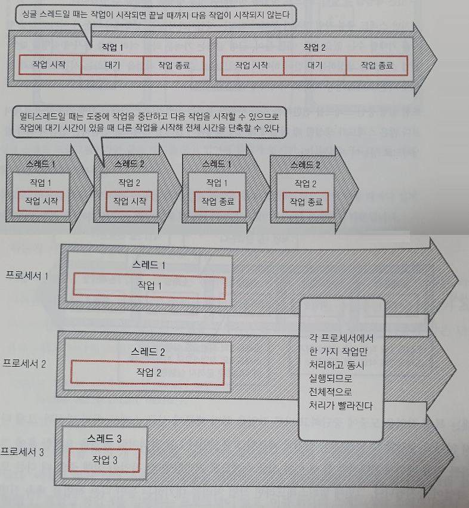

# 비동기(Asynchronous) 처리
비동기 처리는 어떤 작업을 실행하는 동안에 해당 처리가 끝나기를 기다리지 않고 멀티 쓰래딩을 이용하여 다른 작업을 시작하는 것을 뜻한다. 

## 왜?
(DB 혹은 네트워크, 파일읽고 쓰기 같은)오래 걸리는 작업들을 요청하게 되면 프로그램은 해당 처리가 끝날때까지 기다리게 된다.
이때 동기처리(싱글쓰레드)하게 되면 오래 걸리는 처리 만큼 CPU가 대기 하게 된다.

요즘 CPU에는 하나의 프로세스만 있는 것이 아닌 여러개가 탑재된다.   
이런 멀티 프로세스 환경에서 하나의 쓰레드만 사용하는 것은 CPU의 성능을 제대로 활용하지 못한다.

## 성능 주의
* 그렇다고 모든 작업을 스레드를 생성해서 비동기 작업을 하게 될 경우 **스레드 생성 작업에 부하**로 인해 성능 향상을 기대할 수 없다.
가벼운 작업 여러 개를 동시에 실행할 떄 각 작업 스레드를 생성하는 시간이 하나의 스레드에서 순차대로 작업을 실행하는 시간보다 오래 걸리게 되면 오히려 성능 저하로 이어질 수 도 있다.
* **실행 중인 스레드를 전환하는 것도 부하가 걸리는 작업**이다.   
그래서 실행 가능한 프로세서보다 많은 스레드가 생성될 때 작업에 대기가 발생하지 않으면 스레드를 전환하는 만큼 부하가 발생함으로 성능이 저하된다.

## 비동기 처리시 주의
자바에서 비동기 처리를 할 때 싱글 스레드에서 작동하는 프로그램에서는 고려하지 않았던 점을 고려해야한다.

### 메모리와 캐시 동기화 문제
CPU에서는 성능향상을 위해서 Thread별로 CPU 안에 있는 고성능 케시 메모리를 할당해준다. 이 캐시 메모리는 주 메모리(램)와 적절한 시점에 동기화 작업을 하는데 문제는 **클래스 필드가 가리키는 값과 실제 메모리의 값이 다를 수 있다는 점이다.**
A 스레드에서 F 필드 값을 변경했지만 메모리에 반영되지 않은 상태일 경우 B 클래스에서 잘못된 값을 

### 원자성 문제
일련의 처리가 분할할 수 없는 경우를 원자성이라고 하는데 멀티 쓰레드 환경에서는 **특정 메서드를 실행하는 동안 다른 작업이 실행되므로 필드에 접근하면 원자성이 깨질 수 있다.**

예제 소스를 보면 편한데

## 참고 자료
* [멀티코어 프로그래밍에서 흔히 발생하는 메모리 문제 회피하기](https://andromedarabbit.net/%EB%A9%80%ED%8B%B0%EC%BD%94%EC%96%B4-%ED%94%84%EB%A1%9C%EA%B7%B8%EB%9E%98%EB%B0%8D%EC%97%90%EC%84%9C-%ED%9D%94%ED%9E%88-%EB%B0%9C%EC%83%9D%ED%95%98%EB%8A%94-%EB%A9%94%EB%AA%A8%EB%A6%AC-%EB%AC%B8/)