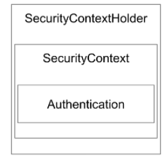

# Spring Security
Spring의 접근을 확인하고 인증하는 모듈

## SecurityContextHolder와 Authentication 관계


Spring SEcurity에서는 인증된 정보를 주로 `Principal`이라는 말로 나타낸다.
`Principal`정보를 `Authentication`이라는 개체안에 담아서 관리한다.
`Authentication`는 `SecurityContext`와 `SecurityContextHolder`로 두번이나 감싸고 있다.

`SecurityContextHolder`는 `SecurityContext`를 제공하는데 기본적으로 `ThreadLocal`을 이용한다.

```java
Authentication authentication = SecurityContextHolder.getContext().getAuthentication();
Object principal = authentication.getPrincipal();
Collection<? extends GrantedAuthority> authorities = authentication.getAuthorities();
Object cradential = authentication.getCredentials();
Boolean authenticaticated = authentication.isAuthenticated();
```
위는 인증된 유저를 가져오는 방법이다.
`SecurityContextHolder.getContext().getAuthentication()`를 통해 `Authentication`을 가져오고 
`authentication`에서 `principal`이라는 인증 정보를 뺀 것이다.
`principal`를 Object형식으로 받아왔지만 주로 `UserDetails`의 구현체(대표적으로 `org.springframework.security.core.userdetails.User`)를 가져온다.

`authentication`에서 그외에도 다른 것들을 가져왔는데
`authentication.getCredentials();`를 통해서 role를 얻어 올 수 있다.

정리하면 `SecurityContextHolder`라는 것이 `authentication`을 담고 있는데  `SecurityContextHolder`는 `ThreadLocal`을 사용해서 `authentication`개체를 Application 어디에서나 접근할 수 있도록 지원한다.

* SecurityContextHolder
    * SecurityContext 제공
    * 기본적으로 ThreadLocal을 사용한다.

* SecuuryContext
    * Authentication 제공.

* Authentication
    * Principal 제공 (인증정보)
    * GrantAuthority 제공 (권한정보)

* Principal
    * "누구"인지에 해당하는 정보. 
    * `UserDetailsService`에서 리턴한 개체 
    * `UserDetails`의 구현한 개체

* GrantAuthority
    * ROLE_USER, ROLE_ADMIN 등과 같이 Principal이 가지고 있는 권한을 리턴

* UserDetails :
    애플리케이션이 가지고 있는 유저 정보와 스프링 시큐리티가 사용하는 Authentication 객체 사이의 어댑터.

* UserDetailsService:
    유저 정보를 UserDetails 타입으로 가져오는 DAO (Data Access Object) 인터페이스
    (구현해야함)
    이건 사용할뿐 실질적으로 인증을 하는 것은 `AuthenticationManager`가 한다.


## AuthenticationManager와 Authentication 관계
**Spring Security에서 인증(Authentication)은 AuthenticationManager가 한다.**    

```java
public interface AuthenticationManager {
	Authentication authenticate(Authentication authentication)
			throws AuthenticationException;
}
```
`AuthenticationManager`는 authenticate라는 메소드 하나만 존재한다.
인자로 받은 `Authentication`이 유효한 인증인지 확인하고 `Authentication` 객체를 리턴한다.
* 확인하는 과정에서 비활성 계정, 잘못된 비번, 잠긴 계정 등의 에러를 던질 수 있다. 
* 구현체는 기본 구현체인 `ProviderManager`를 사용한다.