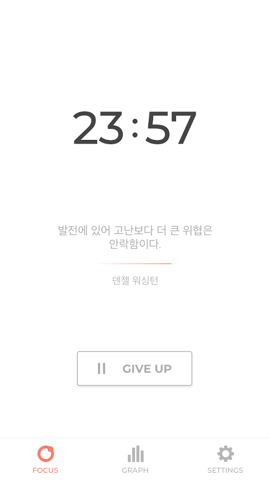
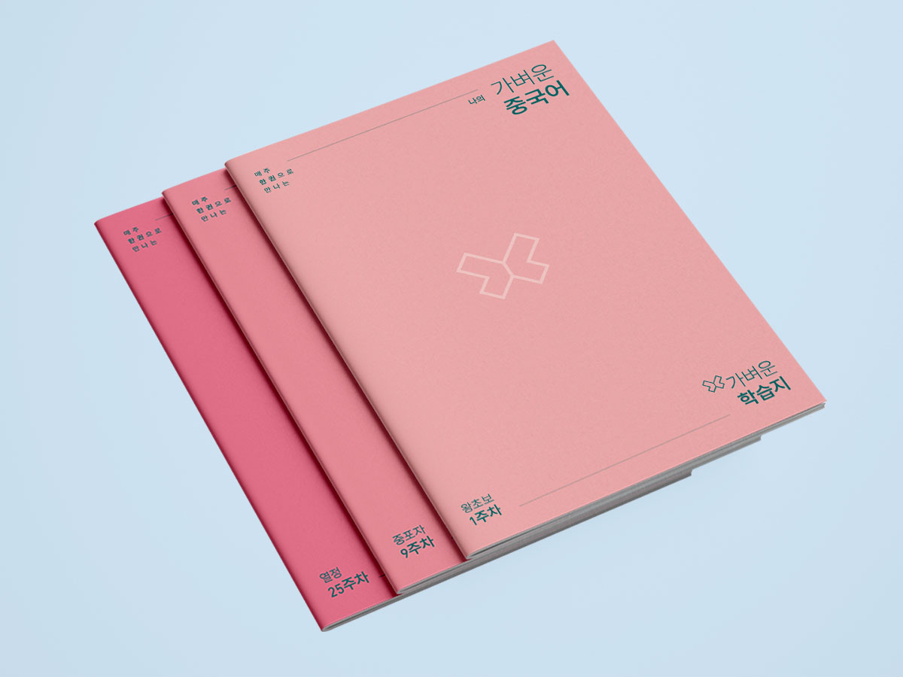
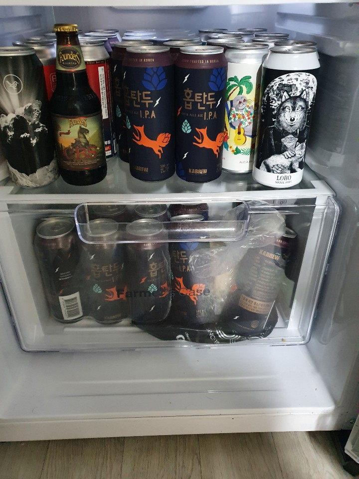

# 2020년 리뷰
올해는 `코로나`라는 팬데믹을 빼고는 할 수 없다.
먼저 올해 최고의 행운을 말하고 싶다. 바로 `짤리지 않은 것이다.`
이건 정말 큰 행운이다.

병역특례라는 특수한 상황에 놓여있기 때문에 짤리면 돈 문제 뿐만 아니라 군이라는 복잡한 문제가 다가온다. 최악의 경우 머리를 밀고 다시 훈련소에 갈 수 있다.

몇가지 관점으로 2020년을 되돌아 보려고 한다.
* 안티프레질
* 성장

안티프레질이란 프레질(부서지기 쉽다는 뜻이며 깨지기 쉬운 화물에 붙는 취급 주의 스티커 문구이기도 하다.)에 'anti'라는 부정을 붙여서 만든 새로운 단어이다.
반대의미만을 뜻하는 것은 아니고 `충격을 받으면 강회된다는 의미`를 가지고 있다.

## 안티프레질
2020년은 프레질한 행동을 돌이켜보면 크게 이정도 있는거 같다.
* 모아둔 돈이 없다.
* 지출통제가 안됬다. (소비와 투자를 나누지도 못했다.)
* 시간을 기록하지도 관리하지도 못했다.
* 건강을 챙기지 못했다. (운동 부족, ㅅㅜㄹ)

올해 최고의 행운을 이야기 했다.
하지만 과연 올해 짤렸을 때를 가정해봤다.
3달안에 병역특례를 하는 회사로 이직을 해야하고 그럴만한 능력을 갖췄나?라고 생각해보면 확신이 없다. (사실 포트폴리오가 에메하다. 회사에서 한것을 사용할수도 없고..)
그럼 **2021년 첫번쨰 목표 포트폴리오의 완성이다.! 지금 개발하고 있는 시간 기록 서비스를 완성하는게 1차 목표인 것이다.!**

### 돈이 없어.
앞서 프레질했던 행동중 `모아둔 돈`이 없다고 했는데 어느정도 모아야 `모아둔 돈`이 있다고 할 수 있을까??
일단은 **2년은 아무일을 안해도 버틸 수 있는 자금을 가지고 있어야 한다고 생각한다.**
아프거나, 사기를 당했거나, 사고가 나거나, 인공지능이 내 일을 대체하거나,등 안좋은 일은 예측 불가능한 일이 생겼을 떄 2년이면 어느정도 회복하거나 새로운 능력을 개설할 수 있다고 생각한다.
그럼 2년동안 버틸 금액을 어찌 선정해야하는걸까?
테슬라의 CEO 가 이야기가 자기가 다 망하면 어떻게 생활할지 이야기 한 것이 있다.
스파게티면만 사서 먹어도 괜찮다는 것이다. (소스도 없이)
그런 것처럼 나도 아주 최악의 상황을 가정하고 생활하는 것을 체험해봐야 한다고 생각한다.
**두번째 목표는 최소한의 생활해보기**이다.
그 데이터를 기반으로 **세번째 목표는 2년치 생존 머니 모으기**이다.

돈을 모으는 것을 목표로 했다면 내 돈이 어떻게 흐르는지 파악해야한다.
뱅크샐러드 모든 은행 카드를 연동해서 내역을 점검해보려고 했는데.. 
카카오 혹은 계좌이체로 결제한 것이 너무 많아서 정확한 데이터를 파악하지 못했다.
하지만 배달을 너무 많이 시켜먹는 다는 것과 맥주에 많은 돈을 쓰고 있다는 걸 알았다.
**네번째 목표는 지출이 생기면 뱅크샐러드에 들어가서 기록하기**이다.

### 시간은 금이다.
`시간은 금이다.`라는 명언이 있듯 시간도 어찌 쓰는지 확인해야한다. 
뱅크샐러드처럼 돈은 이쁜 UI에 편한 UX를 제공하는 앱을 찾지 못했다.
이건 직접 만들어보려고 한다. 사실 12월 중순부터 작업을 시작하였는데 디자이너를 고용하지 못하는 나의 처지에 직접 디자인하고 작업하려고 하니 생산성이 안나오고 있다.
하지만 혼자 처음부터 서비스를 빌드해보고싶기도 하고 좋은 경험이 될거 같다.
그래도 그전까지는 `포커스`라는 앱을 이용해서 의식적으로 집중하는 연습을 할것이다.!

### 건강을 챙겨야한다.
10월달에 목에 담이 계속 걸려서 한의원에가서 침을 여러번 맞았다. 
몸에 어느 한부분이 아프니 집중도 안되고 잘못하면 골로갈 수 있다고 생각했다. 
2년간 헬스장을 등록하며 깨달은 것은 자유 운동이다보니 핑계를 대며 자꾸 빠진다는 것이다. (코로나라는 완벽한 핑계가 있긴 했다.)
올해는 40만원에 1년 결제했는데 10번도 안간것 같네..
수업형식이며, 유연성을 늘릴 수도 있고 (손이 발가락에 안닿는다), 코어 운동도 되는 요가를 하고 싶다.

요가 학원 포스터를 받으면 여자만 가능이라고 적힌 내용이 많아 슬펐다.
나와 비슷한 고민을 한 분이 [남자요가 학원을 찾는 법](https://blog.naver.com/breatheye/221275066455)이라고 감사하게 올려놔 주셨다.
지금은 **코로나 2.5단계여서 1단계로 내려가면 요가 등록이다!!**

## 성장
올해 성장, 성과들을 기념하고 부족한 부분을 어떻게 채울지 고민해보려고 한다.

### 기념할만한 일
* 고려대학교 수시 합격!
* 맥주에 대해서 어느정도 이야기하고 찾을 수 있는 능력이 되었다.
* 11권의 책을 읽었다.
* 안드로이드 개발자라고 조금은 이야기 할 수 있다.
* 포큐 2과목을 들었다.! (84, 84라서 턱걸이 F지만ㅠ)

**반성 기록을 제대로 하지 않으니 기념할만한 것을 찾는 것도 얼마나 성장했는지 측정하는 것도 제대로 되지 못했다. 기억에 의존해 쓰니 제대로 나를 못봐라볼 가능성이 크다.**

### 고려대학교
고려대학교 컴퓨터학과에 입학을 하게 되었다.
이런 성과를 달성하는데 또비의 도움이 없었다면 불가능했다. 
학교를 진학하도록 격려한 것도 자소서와 면접 준비를 서포팅 해준 것도 전부 또비였다. 감사의 마음을 남기고 싶었다.

`준비되지 않은 사람에게 기회는 곧 위기다` 솔직히 내 영어, 수학 실력이 다른 학생들보다 격차가 엄청날 것이라는 것은 너무 자명한 사실이다. 
일단 나는 일반고를 나오지 않았기 때문에 일반 교과 과정 수업을 하나도 듣지 못했기에 이부분을 최소한으로 채워야 한다.
심각한 것은 어느정도가 최소한인지 어떻게 공부를 해야하는지 방법을 모른다는 것이다. 
다행인 것은 군 문제로 1학년 1학기를 휴학할 수 있기에 7개월이라는 시간이 주워졌다.

일단 심각한 영어는 [나의 가벼운 학습지](https://mylight.co.kr/)라는 인터넷 강의를 신청했다. 

저정도 되는 학습지를 1주일에 한권씩 끝내서 1년 과정인데 나는 시간이 없으니 
하루에 하나씩 끝내기로 했다.
시작은 영어공부하는 습관을 먼저 잡아야 겠다고 생각해서 한 행동이였다.
적는 시점에 8일째 8권을 끝내였다.

### 맥주는 (예)술이다.
맥주에 열광적으로 빠지게 되었다.
원래도 좋이하긴 했었지만 편의점에서 4캔에 마넌을 가끔 사먹는 정도였지 맥주 맛이 어떤지 향은 어떤지 따져가며 먹지 않았다. 
이건 사실 연희동 옆옆옆옆옆집에 사는 강한솔형의 영향이 컸다.
4캔의 마넌 맥주 말고 다른 맥주가 있다는 것을 알게 해줬다.
그리고 한국에도 많은 브루어리가 있고 정말 다양한 맥주들을 마셔봤다.
2020년 12월 31일 기준으로 내 냉장고 사진을 보면 맥주에 얼마나 미쳐있는지 알 수 있다.

* 말그림의 CBS라는 맥주는 저거 하나에 2마넌이 넘는다.

하지만 올해는 더 미칠 예정이다.
인스타그램에 [35_bear](https://www.instagram.com/3oh_beer/?hl=ko)라는 인스타 계정도 만들었다. 마셨던 맥주들은 여기에 리뷰를 올릴것이다.

그리고 양조도 해보고싶다. 그러기 위해서는 내가 좋아하는 스타일이 어떤 것인지 기록이 먼저다!

### 독서
먼저 독서를 얼마나 했는지 알아보려고 한다.
올해 읽은 책 리스트를 뽑아봤다.  
* [초집중](http://www.kyobobook.co.kr/product/detailViewKor.laf?ejkGb=KOR&barcode=9791135485121)
* [RxJava 리액티브 프로그래밍](http://www.kyobobook.co.kr/product/detailViewKor.laf?ejkGb=KOR&barcode=9791160507461)
* [대통령이 사라졌다](http://www.kyobobook.co.kr/product/detailViewKor.laf?ejkGb=KOR&barcode=9791135489327)
* [부자 되는 법을 가르쳐 드립니다](http://www.kyobobook.co.kr/product/detailViewKor.laf?ejkGb=KOR&barcode=9791135455063)
* [후츠파](http://www.kyobobook.co.kr/product/detailViewKor.laf?ejkGb=KOR&barcode=9791135490798)
* [폴리매스](http://www.kyobobook.co.kr/product/detailViewKor.laf?ejkGb=KOR&barcode=9791135488399)
* [인생의 마지막 순간에서](http://www.kyobobook.co.kr/product/detailViewKor.laf?ejkGb=KOR&barcode=9791135488399)
* [숙면의 모든 것](http://www.kyobobook.co.kr/product/detailViewKor.laf?ejkGb=KOR&mallGb=KOR&barcode=9791135459771&orderClick=LEa&Kc=)
* [베스트 셀프](http://www.kyobobook.co.kr/product/detailViewKor.laf?ejkGb=KOR&mallGb=KOR&barcode=9791135444968&orderClick=LAG&Kc=)
* [맥주의 정석](http://www.kyobobook.co.kr/product/detailViewKor.laf?mallGb=KOR&ejkGb=KOR&barcode=9791196912703&orderClick=JBD)
* [폴리매스](http://www.kyobobook.co.kr/product/detailViewKor.laf?ejkGb=KOR&mallGb=KOR&barcode=9791135488399)

한달에 한권을 최소로 읽겠다고 했었는데 11권밖에 못읽었다.
이중에서는 끝까지 못읽은 책도 있고 서평을 쓴 책은 두권밖에 없다.
문제를 찾아보니 9월부터 11월까지 독서를 거의 하지 않았다. 
그때 대학교 준비를 하느라 바뻐서 읽지 못했다는 핑계를 할 수 있지만 생각해보면 자기전 유트브만 보지 않았어도 읽었을 것이다.
그리고 책을 미리 사놓지 않으니 호기심에 책을 들어올리지 않은 것도 큰 것 같다. 
일단 **체인지그라운드에서 추천하는 책은 전부 사려고 한다.**
그리고 개발 관련한 도서는 목차를 보고 충분히 인터넷에 정보가 많다고 하면 목차를 지도삼아 하나씩 공부해가며 정리하자, 정보가 충분하지 않다면 사서 보는 것도 좋다!
개발 책을 사는게 돈이 아까운게 아니라, 책을 대충 보고서 내가 알고 있다고 착각을 했었다.

### 포큐 욕 아니에요!
살면서 봤던 최고의 교육기관이다.
후기도 2개나 썻다.
* https://yeh35.github.io/blog.github.io/documents/pocu/comp2500/
* https://yeh35.github.io/blog.github.io/documents/pocu/comp2200/

더 이야기 할 필요는 없을거 같고 아직 모든 코스가 개발된 것이 아니라서 출시되는 족족 들을 것이다.

## 정리
2020년을 기억이 닿는데로 정리해봤다.
딱히 한게 없다고 생각했는데 적고보니 나름 아둥바둥 열심히 지냈던거 같다.
반성을 쭈욱 했으니, 이제 새해를 기념하러 맥주를 쭈욱 들이키러 간다.

## 2021 TODO
2021 TODO 리스트가 
* 시간 기록 서비스
* 2년은 아무일을 안해도 버틸 수 있는 자금 모으기
* 

